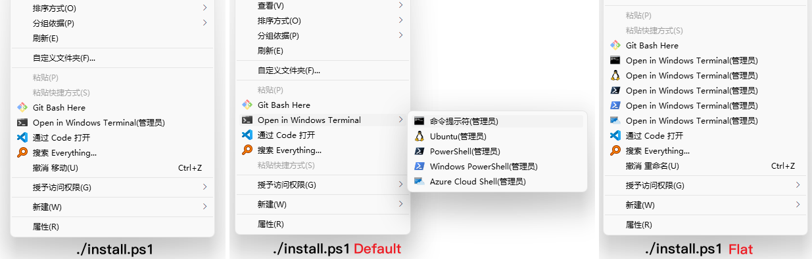

# Open Windows Terminal

鼠标右键添加 Open in Windows Terminal

## 方式一、注册表文件

右键菜单可能会没有图标, 把`ico`文件夹或者把这张图片放到`C:\Users\{电脑的用户名}\Pictures`下面，或者直接`win+r`输入`%HOMEPATH%\Pictures`回车

**注意: 这种方法生成的右键菜单打开窗口会有闪烁, 推荐下面脚本自动生成**

## 方式二、脚本自动生成

*A project backed by [LeXtudio Inc.](https://www.lextudio.com)*

### 1. 安装指南

1. [安装 Windows Terminal](https://github.com/microsoft/terminal).
2. [安装 PowerShell 7](https://docs.microsoft.com/en-us/powershell/scripting/install/installing-powershell-core-on-windows?view=powershell-7).
3. 以**管理员身份**启动 PowerShell 7 控制台 (Powershell 5 是**不行**的)，然后运行 `ps1` 目录下的 `install.ps1` 脚本，将【上下文菜单项】安装到 Windows 资源管理器。现在，菜单项已添加到 Windows 资源管理器上下文菜单了。

> **图 1**: 三种安装方式，注意，一定要在**管理员模式**下安装，切记！(个人比较喜欢**默认**的 `Mini` 模式)

## 2. 安装示例

1. 以管理员身份打开刚安装好的 Powershell Core 7，然后切换工作目录到本库
2. 确保网络畅通；
3. 执行 `install.ps1`，然后你将获得一个**类似图 1 中的第 1 幅图**的桌面、文件夹右键菜单。

> 如果只运行 `install.ps1` 而不加参数，那么菜单项将以 `Mini` 布局组织。 其他布局（如 `Default` 和 `Flat`）具有不同的外观。 要应用其他布局（如 `Flat`），只需运行 `install.ps1 Flat`。

## 3. 卸载

以管理员身份，在 PowerShell Core 7 中，执行 `uninstall.ps1 [Default | Flat]` 即可删除该配置。

## 4. 注意

- 当前版本仅支持 Windows 10 及以上；
- `install.ps1` 和 `uninstall.ps1` 脚本**必须**以管理员身份运行；
- **必须**在版本 >= 6 的 PowerShell 下执行脚本；
- `install.ps1` 和 `uninstall.ps1` 仅操作上下文菜单项的 Windows 资源管理器设置，而不写入 Windows Terminal 的设置；
- 从 GitHub 下载 Windows Terminal 图标 (在 `install.ps1` 中) 需要 Internet 连接，最好在运行 `install.ps1` 时，将代理软件设置为全局代理；
